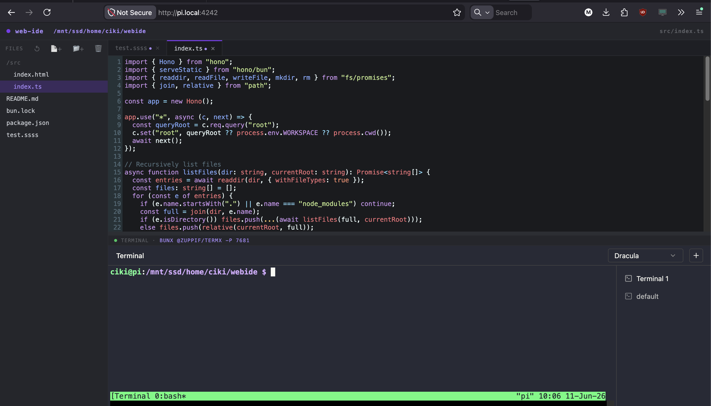

# web-ide

Minimal web IDE — file tree + CodeMirror editor + termx terminal.



## Stack
- **Runtime**: Bun
- **HTTP**: Hono
- **Editor**: CodeMirror 5 (material theme, switched from one-dark due to CDN issue)
- **Terminal**: [@zuppif/termx](https://www.npmjs.com/package/@zuppif/termx) via iframe

## Files
```
src/index.ts      # Hono server + file API (CRUD)
src/index.html    # IDE frontend (single file)
```

## Usage

```bash
# Install deps
bun install

# Start terminal server in one terminal
bunx @zuppif/termx -p 7681

# Start IDE server in another terminal
bun run dev
# or: WORKSPACE=/your/project bun run dev
```

Open: http://localhost:4242

## Environment
| Var | Default | Description |
|-----|---------|-------------|
| `PORT` | `4242` | IDE server port |
| `WORKSPACE` | `process.cwd()` | Root directory to edit |

## Keyboard
- `Ctrl+S` / `Cmd+S` — save current file

## API
| Method | Path | Description |
|--------|------|-------------|
| GET | `/api/files` | List all files recursively |
| GET | `/api/file?path=...` | Read file content |
| POST | `/api/file` | Write or create file `{ path, content }` |
| POST | `/api/mkdir` | Create folder `{ path }` |
| DELETE | `/api/file?path=...` | Delete file or folder |
